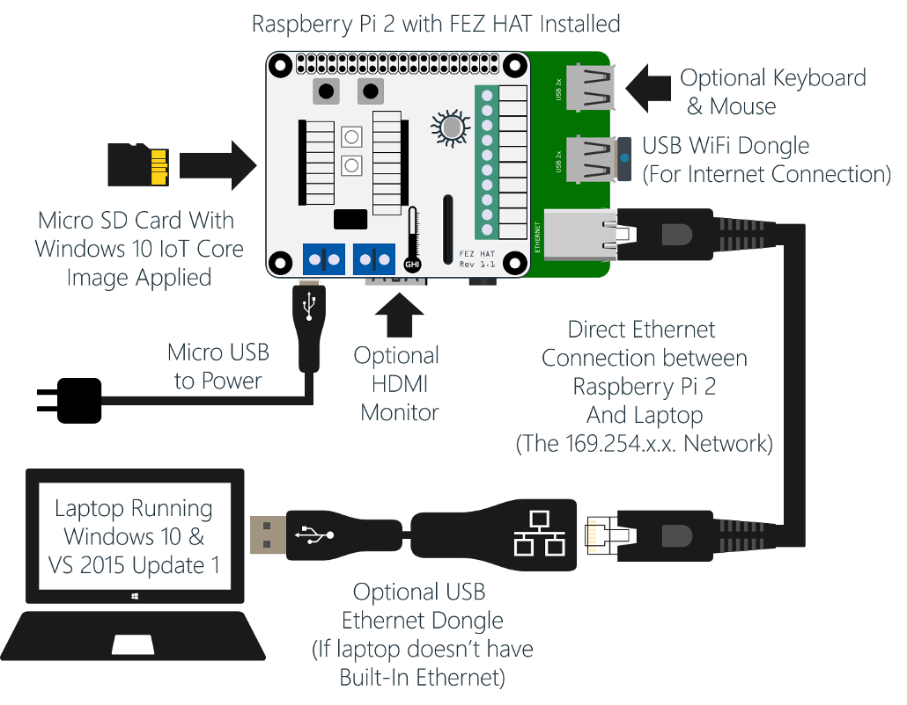

<a name="Task1" />
## Setup
The following sections are intended to setup your environment to be able to create and run your solutions with Windows 10 IoT Core.

<a name="Task11" />
### Setting up your Software
To setup your Windows 10 IoT Core development PC, you first need to install the following:

- Windows 10 (build 10240) or better

- Visual Studio 2015 or above – [Community Edition](http://www.visualstudio.com/downloads/download-visual-studio-vs) is sufficient.

	> **NOTE:** If you choose to install a different edition of VS 2015, make sure to do a **Custom** install and select the checkbox **Universal Windows App Development Tools** -> **Tools and Windows SDK**.

	You can validate your Visual Studio installation by selecting _Help > About Microsoft Visual Studio_. The required version of **Visual Studio** is 14.0.23107.0 D14Rel. The required version of **Visual Studio Tools for Universal Windows Apps** is 14.0.23121.00 D14OOB.

- Windows IoT Core Project Templates. You can download them from [here](https://visualstudiogallery.msdn.microsoft.com/55b357e1-a533-43ad-82a5-a88ac4b01dec). Alternatively, the templates can be found by searching for Windows IoT Core Project Templates in the [Visual Studio Gallery](https://visualstudiogallery.msdn.microsoft.com/) or directly from Visual Studio in the Extension and Updates dialog (Tools > Extensions and Updates > Online).

- Make sure you’ve **enabled developer mode** in Windows 10 by following [these instructions](https://msdn.microsoft.com/library/windows/apps/xaml/dn706236.aspx).

- To register your devices in the Azure IoT Hub Service and to monitor the communication between them you need to install the [Azure Device Explorer](https://github.com/Azure/azure-iot-sdks/releases/download/2016-04-22/SetupDeviceExplorer.msi).

<a name="Task12" />
### Setting up your Devices

For this project, you will need the following:

- [Raspberry Pi 2 Model B](https://www.raspberrypi.org/products/raspberry-pi-2-model-b/) with power supply
- [GHI FEZ HAT](https://www.ghielectronics.com/catalog/product/500)
- Your PC running Windows 10, RTM build or later
- An Ethernet port on the PC, or an auto-crossover USB->Ethernet adapter like the [Belkin F4U047](http://www.amazon.com/Belkin-USB-Ethernet-Adapter-F4U047bt/dp/B00E9655LU/ref=sr_1_2).
- Standard Ethernet cable
- A good 16GB or 32GB Class 10 SD card. We recommend Samsung or Sandisk. Other cards will usually work, but tend to die more quickly.
- A WiFi dongle from the [list of devices that are currently supported by Windows 10 IoT Core on the Raspberry Pi 2](http://ms-iot.github.io/content/en-US/win10/SupportedInterfaces.htm#WiFi-Dongles)

To setup your devices perform the following steps:

1. Plug the **GHI FEZ HAT** into the **Raspberry Pi 2**.

	

	_The FEZ hat connected to the Raspberry Pi 2 device_

2. Get a Windows 10 IoT Core SD Card or download the **Windows 10 IoT Core** image as per the instructions on <http://ms-iot.github.io/content/en-US/win10/RPI.htm>, be sure to follow the steps to mount the image, and run the installer on your development PC. If you already have the OS image on a card, you still need to follow this step to get the IoT Core Watcher and Visual Studio templates on to your PC.

3. Once you have the image on the card, insert the micro SD card in the Raspberry Pi device.

4. Connect the Raspberry Pi to a power supply, optionally a keyboard, mouse and monitor, and use the Ethernet cable to connect your device and your development PC. You can do it by plugging in one end of the spare Ethernet cable to the extra Ethernet port on your PC, and the other end of the cable to the Ethernet port on your IoT Core device. (Do this using an on-board port or an auto-crossover USB->Ethernet interface.)

	

5. Wait for the OS to boot.

6. Run the **Windows 10 IoT Core Watcher** utility (installed in step 2) in your development PC and copy your Raspberry Pi IP address by right-clicking on the detected device and selecting **Copy IP Address**.

	- Click the windows "**Start**" button
	- Type "**WindowsIoTCoreWatcher**" to pull it up in the search results
	- You may want to right click on the program name and select "**Pin to Start**" to pin it to your start screen for easy access
	- Press **Enter** to run it
	- Your device should appear in the list within 5 seconds or so. If it does not, close the Windows 10 IoT Core Watcher, and relaunch it again

	

7. Launch an administrator PowerShell console on your local PC. The easiest way to do this is to type _powershell_ in the **Search the web and Windows** textbox near the Windows Start Menu. Windows will find **PowerShell** on your machine. Right-click the **Windows PowerShell** entry and select **Run as administrator**. The PS console will show.

	

8. You may need to start the **WinRM** service on your desktop to enable remote connections. From the PS console type the following command:

	`net start WinRM`

9. From the PS console, type the following command, substituting '<_IP Address_>' with the IP value copied in prev:

	`Set-Item WSMan:\localhost\Client\TrustedHosts -Value <machine-name or IP Address>`

10.  Type **Y** and press **Enter** to confirm the change.

11. Now you can start a session with you Windows IoT Core device. From you administrator PS console, type:

	`Enter-PSSession -ComputerName <IP Address> -Credential localhost\Administrator`

12. In the credential dialog enter the following default password: `p@ssw0rd`.

	> **Note:** The connection process is not immediate and can take up to 30 seconds.

	If you successfully connected to the device, you should see the IP address of your device before the prompt.

	

#### Renaming your Device and Checking the Date and Time

1. To change the _computer name_, use the **setcomputername** utility. In PowerShell, type the following command.

	`setcomputername <new-name>`

1. The date and time on the Pi must be correct for the security tokens used to publish to Azure later in the lab to be valid.  To check the current time zone setting on the Pi, type:

	`tzutil /g`

1. If the time zone reported is not correct, you can find a list of valid time zones using (you may need to increase the buffer size on your powershell window):

	`tzutil /l`

1. To set the time zone, locate the id of the time zone you want from the step above, then use:

	`tzutil /s "Your TimeZone Name"

	For example, for "Pacific Standard Time"

	`tzutil /s "Pacific Standard Time"

1. To check the date on the Raspberry Pi, type

	`Get-Date`

1. If the date or time is incorrect, use the `Set-Date` utility

	`Set-Date "mm/dd/yy hh:mm:ss AM/PM"`

	For Example, if it was 12:15 pm on January 3rd, 2016:

	`Set-Date "01/03/16 12:15 PM"`

2. **Reboot the device for the change to take effect**. You can use the shutdown command as follows:

	`shutdown /r /t 0`

3. Finally, connect to the Raspberry Pi to the same network as your Windows 10 development PC.

You can also rename the device and set the time zone by using the web server, but certain functions, like actually changing the date and time, are currently available only through PowerShell. Now that you understand how to connect through PowerShell, we'll use the web server to set up WiFi.

#### Using WiFi on your Device

1. To configure your device, run the **Windows 10 IoT Core Watcher** utility in your development PC and open the [web-based management](http://ms-iot.github.io/content/en-US/win10/tools/DevicePortal.htm) application by right-clicking the detected device and selecting **Web Browser Here**.  To launch the "Windows 10 IoT Core Watcher" utility:

	

2. To use WiFi, you will need to provide Windows 10 IoT core with the WiFi network credentials.
	1. Enter **Administrator** for the username, and supply your password (_**p@ssw0rd**_ by default).
	2. Click **Networking** in the left-hand pane.
	3. Under **Available networks**, select network you would like to connect to and supply the connection credentials. Click **Connect** to initiate the connection.  Make sure the "**Create profile (auto re-connect)**" check box is **checked** so that the WiFi network will reconnect automatically if the Raspberry Pi reboots. 

	

	> **Note:** You can find more info in [Using WiFi on your Windows 10 IoT Core device](https://ms-iot.github.io/content/en-US/win10/SetupWiFi.htm).
